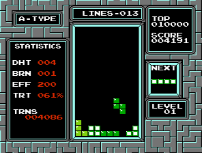
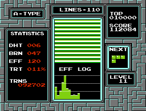

# TAUS, et al

[Source Repository](https://github.com/ejona86/taus)

The main project is the Actually Useful Statistics Tetris mod. However, the
repository also contains disassembly knowledge for tetris, a structure for
building NES ips/nes files, and a LUA-based unit/integration test helpers.

## TAUS

TAUS provides the in-game statistics:
 * DHT: The drought. The number of pieces since the last line
 * BRN: The burn. The number of lines cleared since the last tetris
 * EFF: The efficiency. The score per lines as if on level 0. Individual
   clears have score per lines of: 40 for a single, 50 for a double, 100 for a
   triple, 300 for a tetris
 * TRT: The tetris rate. The percentage of lines cleared that were tetrises
 * TRNS: The transition score. The score achieved when leaving the starting
   level

TAUS provides the post-game statistics:
 * EFF LOG: A chart for the EFF progression through the game with each bar
   cooresponding to the EFF of 10 lines cleared. The EFF presented is not the
   cumulative EFF to that point, but the EFF of the 10 lines in isolation.
   It tracks each line clear separately, so if you have cleared 8 lines and
   then clear a tetris that is considered two lines followed by two more lines

The mod also allows skipping the legal screen.

EFF is similar in purpose to the conventional TRT. Both assume you die because
you reach too high of a level (e.g., level 29) and both let you know for "how
well are you doing" in the middle of the game. But EFF is a strong predictor
of your final score. For example, let's say you start on level 9 and
die after 100 lines. If you alternate between tetrises and singles, your final
score will be ~248k. But if you alternate between tetrises and triples, your
final score will be ~214k (ignoring the fact you can get over 100 lines by
finishing with a tetris). TRT will be 80% and 57% showing the first game has a
40% better performance, but your EFF was 248 and 214 showing a 16% better
performance which agrees with the score. If your EFF increases by 10%, then
your score roughly increases ~10% for the same number of lines.

## How to run

There should be a pre-built IPS file for the most recent release. It should be
applied to the USA Tetris ROM, commonly known as "Tetris (U) [!].nes". The ROM
has CRC32 `6d72c53a`, MD5 `ec58574d96bee8c8927884ae6e7a2508`, and
SHA1 `77747840541bfc62a28a5957692a98c550bd6b2b`. Ignoring the 16 byte iNES
header (`tail -c +17 tetris.nes > no-header.nes`), it has CRC32 `1394f57e`,
MD5 `5b0e571558c8c796937b96af469561c6`, and
SHA1 `fd9079cb5e8479eb06d93c2ae5175bfce871746a`. It is generally okay if the
iNES header is different.

## How to build

You only need to build if you are making changes or want to try out changes
that have not yet been included in a release.

Dependencies (should be in PATH):
1. [Flips](https://github.com/Alcaro/Flips). [Flips
   1.31](https://www.smwcentral.net/?p=section&a=details&id=11474) is fine
2. [cc65](https://cc65.github.io)
3. GNU Make. Windows users can use `make.exe` from
   [UnxUpdates.zip](http://unxutils.sourceforge.net/) (just the one file) or
   [GnuWin32 Make](http://gnuwin32.sourceforge.net/packages/make.htm)
4. GNU Coreutils and Sed. These are standard on Linux. On Windows they are
   provided by [Git for Windows](https://git-scm.com/download/win) when using
   the "Git Bash" command line. Note that it uses a Unix directory structure;
   the Windows directory structure is within the `/c/` directory

On Windows, to modify your PATH, run `SystemPropertiesAdvanced.exe`. On the
"Advanced" tab click "Environment Variables" and then change `Path` in your
"User variables" and hit Okay. You will need to restart any terminals for the
changes to take effect.

Manual prep:
1. Copy tetris ROM to `tetris.nes`. If the iNES header is different you can
   still use the ROM, but you need to adjust the header in tetris.s. Ignore
   iNES header issues for now. `$ make test` will fail if this is a problem.

Use `$ make` to build artifacts into `build/`, which includes disassembling
into `build/tetris-PRG.s`. `$ make test` verifies the reassembled version
matches the original. The mod will be generated at `build/taus.ips` and will
have been applied to `build/taus.nes`.

## Structure

tetris-PRG.info is the location for all tetris ROM knowledge. It is used to
disassemble tetris into build/tetris-PRG.s. tetris.s and tetris.nes.info
contain the pieces to reassemble tetris into a iNES file. Reassembly is able to
output debug information.

The main debug output is the .lbl file. It is basic and just contains the
labels with their addresses, so doesn't have any more information than
tetris-PRG.info. However, it is easy to parse so the file format is used for
several other tasks; it is transformed into build/tetris.inc using sed and can
be read directly by the LUA testing tools.

NES and IPS files are output directly by the linker, because our .s files
define the headers for the formats and the .cfg files specify the ordering of
the headers/chunks. The linker is fairly well suited to the job and provides
the ability to mix-and-match source files when generating an IPS file, only
needing to manually sort the hunks. It is useful to have understanding of the
IPS format and how it works. It is basically the simplest possible patch
format, only supporting 1:1 replacing, so should be easy to learn.

The [Nesdev Wiki](https://wiki.nesdev.com/w/index.php/NES_reference_guide) has
good resources for the various file formats. The .info file format is described
in the [da65 (disassembler)
documentation](https://www.cc65.org/doc/da65-4.html). The .cfg file format is
described in the [ld65 (linker)
documentation](https://www.cc65.org/doc/ld65-5.html).

## Creating new NES/IPS files

To create a new NES file output (IPS/NES file), simply create a new .cfg file,
mirroring one of the existing ones (depending on what you are making), and any
.s files for the source. Then modify the Makefile to list the object files you
want to include within your IPS/NES file. These will be in the form
build/ORIGNAME.o corresponding to each ORIGINAL.s file. If your .cfg file was
named `myfile.ext.cfg`, then run `$ make build/myfile.ext` to build the output.
The extension used does not matter to the Makefile nor linker.
