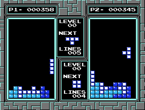
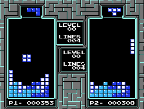
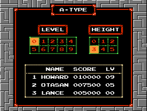
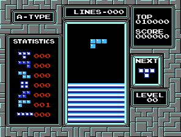
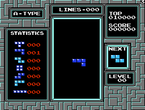

# TAUS, et al

[Source Repository](https://github.com/ejona86/taus)

The main project is the Actually Useful Statistics Tetris mod. However, the
repository also contains disassembly knowledge for tetris, a structure for
building NES ips/nes files, and a LUA-based unit/integration test helpers.

## How to run

Pre-built IPS mod files are available in the
[releases section of GitHub](https://github.com/ejona86/taus/releases). They
must be applied to the USA Tetris ROM:

```
Database match: Tetris (USA)
Database: No-Intro: Nintendo Entertainment System (v. 20180803-121122)
File SHA-1: 77747840541BFC62A28A5957692A98C550BD6B2B
File CRC32: 6D72C53A
ROM SHA-1: FD9079CB5E8479EB06D93C2AE5175BFCE871746A
ROM CRC32: 1394F57E
```

Or the Europe Tetris ROM:

```
Database match: Tetris (Europe)
Database: No-Intro: Nintendo Entertainment System (v. 20180803-121122)
File SHA-1: 817169B819AADAAE52CCE6B3D8D2FC24270566D7
File CRC32: 8319B091
ROM SHA-1: 66883B9EDDEC933E36B6BFF0479CEFD2434FFB40
ROM CRC32: FDFF80D5
```

You can use [Hasher-js](https://www.romhacking.net/hash/) or [ROM
Hasher](https://www.romhacking.net/utilities/1002/) to verify your ROM matches.
It is generally okay if the "ROM" checksum matches, but the "File" checksum
differs. But note that `make test` will fail.

## TAUS

[](media/stats-ingame.aspect.png)
[](media/stats-postgame.aspect.png)

TAUS provides the in-game statistics:
 * DHT: The drought. The number of pieces since the last line
 * BRN: The burn. The number of lines cleared since the last tetris
 * EFF: The efficiency. The score per lines ignoring the level multiplier.
   Individual clears have score per lines of: 40 for a single, 50 for a double,
   100 for a triple, 300 for a tetris
 * TRT: The tetris rate. The percentage of lines cleared that were tetrises
 * TRNS: The transition score. The score achieved when leaving the starting
   level

TAUS provides the post-game statistics:
 * EFF LOG: A chart for the EFF progression through the game with each bar
   cooresponding to the EFF of 10 lines cleared. The EFF presented is not the
   cumulative EFF to that point, but the EFF of the 10 lines in isolation.
   It tracks each line clear separately, so if you have cleared 8 lines and
   then clear a tetris that is considered two lines followed by two more lines

The mod also allows skipping the legal screen.

EFF is similar in purpose to the conventional TRT. Both assume you die because
you reach too high of a level (e.g., level 29) and both let you know for "how
well are you doing" in the middle of the game. But EFF is a strong predictor
of your final score. For example, let's say you start on level 9 and
die after 100 lines. If you alternate between tetrises and sets of three
singles, your final score will be ~188k. But if you alternate between tetrises
and triples, your final score will be ~214k. TRT for each will be 57%, but your
EFF was 188 and 214 agreeing with the 14% better score on the second game. If
your EFF increases by 10%, then your score increases ~10% for the same number
of lines.

## Two Player

[](media/twoplayer-side.aspect.png)
[](media/twoplayer-top.aspect.png)

The twoplayer mod allows two simultaneous players to play while receiving the
same pieces. Garbage is not sent between players. The mod is incompatible with
the TAUS mod.

There are two variations of the mod. One shows the next piece on the side,
which makes it easier to see with peripheral vision. The other shows it on top,
which makes it clearer at-a-glance which next piece belongs to which player.

## Handicap

[](media/handicap-selection.aspect.png)
[](media/handicap-ingame.aspect.png)

The handicap mod provides a height-select for Type A. Instead of Type B's
garbage within the height area the area is simply off-limits and unusable. It
is compatible with the TAUS and twoplayer mods.

This mod was originally created as a training aid. When used with the twoplayer
mod it can level the playing field.

## Player ID

[](media/playerid-ingame.aspect.png)

The playerid mod displays an identifier 1-7 at the top-right of the play
screen, which can be chosen by pressing Select at the level-select screen. It
is compatible with the TAUS and twoplayer mods.

The identifier is intended to help identify the game in a recording, like
determining which player was playing.

## How to build

You only need to build if you are making changes or want to try out changes
that have not yet been included in a release.

Dependencies (should be in PATH):
1. [Flips](https://github.com/Alcaro/Flips). [Flips
   1.31](https://www.smwcentral.net/?p=section&a=details&id=11474) is fine
2. [cc65](https://cc65.github.io/getting-started.html). Starting in Debian 10
   (Buster) and Ubuntu 18.04 (Bionic) a package is available via
   `sudo apt install cc65`. The Fedora package is available via
   `sudo dnf install cc65`. Arch Linux has an
   [AUR package](https://aur.archlinux.org/packages/cc65/) available.
3. GNU Make. Windows users can use `make.exe` (just the one file) from the
   `bin/` folder of `make-*-without-guile-w32-bin.zip` available at
   [ezwinports](https://sourceforge.net/projects/ezwinports/files/)
4. GNU Coreutils and Sed. These are standard on Linux. On Windows they are
   provided by [Git for Windows](https://git-scm.com/download/win) when using
   the "Git Bash" command line. Note that it uses a Unix directory structure;
   the Windows directory structure is within the `/c/` directory

On Windows, to modify your PATH, run `SystemPropertiesAdvanced.exe`. On the
"Advanced" tab click "Environment Variables" and then change `Path` in your
"User variables" and hit Okay. You will need to restart any terminals for the
changes to take effect.

Manual prep:
1. Copy tetris ROM to `tetris.nes` in the `taus` folder. If the iNES header is
   different than mentioned above you can still use the ROM, but you need to
   adjust the header in `tetris.s` to match your rom to make `$ make test`
   happy

Use `$ make` to build artifacts into `build/`, which includes disassembling
into `build/tetris-PRG.s`. `$ make test` verifies the reassembled version
matches the original. The mod will be generated at `build/taus.ips` and will
have been applied to `build/taus.nes`.

## Structure

tetris-PRG.info is the location for all tetris ROM knowledge. It is used to
disassemble tetris into build/tetris-PRG.s. tetris.s and tetris.nes.info
contain the pieces to reassemble tetris into a iNES file. Reassembly is able to
output debug information.

The main debug output is the .lbl file. It is basic and just contains the
labels with their addresses, so doesn't have any more information than
tetris-PRG.info. However, it is easy to parse so the file format is used for
several other tasks; it is transformed into build/tetris.inc using sed and can
be read directly by the LUA testing tools.

NES and IPS files are output directly by the linker, because our .s files
define the headers for the formats and the .cfg files specify the ordering of
the headers/chunks. The linker is fairly well suited to the job and provides
the ability to mix-and-match source files when generating an IPS file, only
needing to manually sort the hunks. It is useful to have understanding of the
IPS format and how it works. It is basically the simplest possible patch
format, only supporting 1:1 replacing, so should be easy to learn.

The [Nesdev Wiki](https://wiki.nesdev.com/w/index.php/NES_reference_guide) has
good resources for the various file formats. The .info file format is described
in the [da65 (disassembler)
documentation](https://www.cc65.org/doc/da65-4.html). The .cfg file format is
described in the [ld65 (linker)
documentation](https://www.cc65.org/doc/ld65-5.html).

## Creating new NES/IPS files

To create a new NES file output (IPS/NES file), simply create a new .cfg file,
mirroring one of the existing ones (depending on what you are making), and any
.s files for the source. Then modify the Makefile to list the object files you
want to include within your IPS/NES file. These will be in the form
build/ORIGNAME.o corresponding to each ORIGINAL.s file. If your .cfg file was
named `myfile.ext.cfg`, then run `$ make build/myfile.ext` to build the output.
The extension used does not matter to the Makefile nor linker.

For any modifications to the original ROM, creating the IPS hunks directly
works well for 1) mods with few changes and 2) injecting a jsr to a custom
function. If you need to make changes that don't reference any new labels, then
you can manage a .diff file. The .diff is intended to be checked in and is
applied to build/diffhead-YOURFILENAME. You can change the diffhead and `make`
will re-generate the .diff. Similarly, changing the .diff will re-generate the
diffhead.
